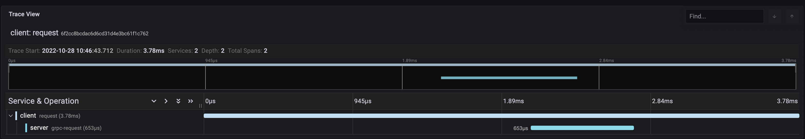

# Traces
Example shows Tonic grpc Client and Server OpenTelemetry context propagation and export to Grafana Cloud's Tempo service.

To export traces to grafana you will need to set up [otel-config.yaml](https://github.com/elefant-dev/fregate-rs/blob/main/examples/grafana/otel-config.yaml)
You might want to refer to [grafana tutorial](https://grafana.com/blog/2021/04/13/how-to-send-traces-to-grafana-clouds-tempo-service-with-opentelemetry-collector) on how to get Grafana Cloud URL and credentials for Tempo.
After otel-config.yaml set up run:

```zsh
docker run -v {path to your otel-config.yaml}:/etc/otelcol/config.yaml -d -p 4317:4317 otel/opentelemetry-collector:0.54.0
docker run -v /home/kos/pro/subject/etring/fregate_review/examples/grafana:/etc/otelcol -d -p 4317:4317 otel/opentelemetry-collector:0.54.0

```

Run Server:
```zsh
cargo run --package grafana --bin hello-server
```

Run Client:
```zsh
cargo run --package grafana --bin hello-client
```

View traces in grafana:

